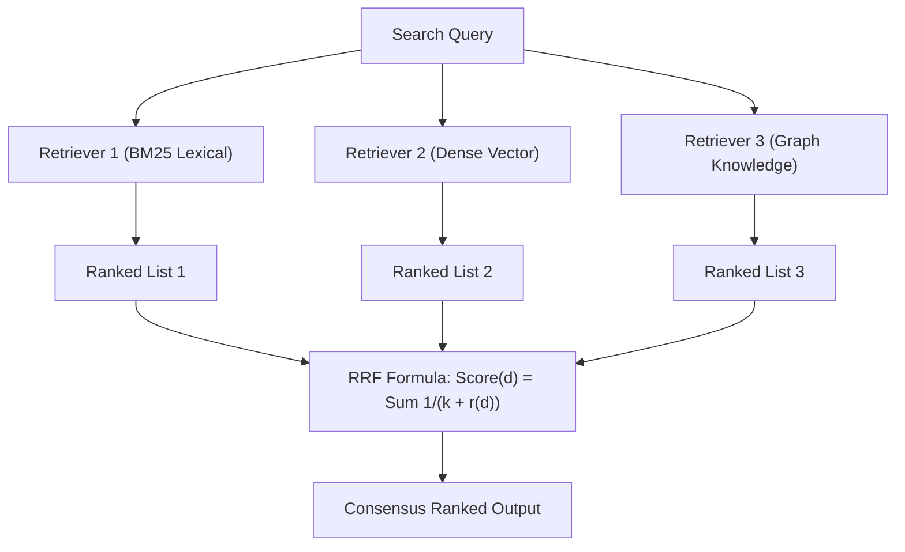

# genpark-reciprocal-rank-fusion-rrf-reranker-skill

Agent Skill implementing **Reciprocal Rank Fusion (RRF)** rank aggregation for hybrid search pipelines in 100% Python standard library.

## Architectural Flow

